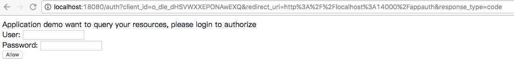
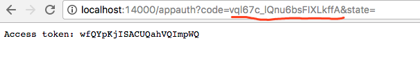

# Overview

This project is a demo of OAuth2.0 server build on [osin](https://github.com/RangelReale/osin) with services 
organized with [go-kit](https://github.com/go-kit/kit)

# Build

The project could be build into a Dockerized server with __'make docker-build'__. An local image named 'auth-server' is 
available after that.

There are two CLI client demos whose images can be obtained by __'make docker-build-demo'__. 'demo-auth' image could be
used to query the server to get access tokens. Some clients and users should be created with 'demo-manage' image before
we get access tokens.

# Run

## Start Mysql

All resources the server needs are stored in Mysql, so we should start a Mysql server at first and create a 'demo' 
database:

```
$ docker run -e MYSQL_ROOT_PASSWORD=demo -p 3306:3306 -p 18080:18080 -p 14000:14000 -d --rm --name mysql mysql:5.7
06142e803c1d556b0d1e907bd72e2855e5319fb321b2ee62233d16107aac2e4a

$ docker exec -ti mysql mysql -hlocalhost -P3306 -uroot -pdemo -e "create database demo"
mysql: [Warning] Using a password on the command line interface can be insecure.

$ docker exec -ti mysql mysql -hlocalhost -P3306 -uroot -pdemo -e "show databases"
mysql: [Warning] Using a password on the command line interface can be insecure.
+--------------------+
| Database           |
+--------------------+
| information_schema |
| demo               |
| mysql              |
| performance_schema |
| sys                |
+--------------------+
```

## Run auth server

Start the auth server as following:

```
$ docker run -d --rm --network=container:mysql auth-server
83e7a9b9e3a1112804bab1def3aac252820f8a491b956d1a64adb8c85b4a8045
```

The container starts with '--network=container:mysql' parameter so that the server could share the same network with 
mysql container and query it with localhost. 

The server serves the port 18080. As you can see, it is published by the mysql container.

## Create a client and user

OAuth 2 is applied in the situations of authorizing the rights of users' resources to a client. So a client and a user 
should be created before we could continue this demo.

```
$ docker run --rm --network=container:mysql demo-manage create user habor whispir
Success

$ docker run --rm --network=container:mysql demo-manage create client demo
Created client with id 'o_dle_dHSVWXXEPONAwEXQ' and secret '9d558ceae64f25743aee70d423673ad1'
```

Now we have a user named 'habor' with password 'whispir' and a client 'demo'. Remember the client id and secret.

## Get access token

### Password Grant

The [Password](https://www.oauth.com/oauth2-servers/access-tokens/password-grant/) grant is a grant type to authorize 
rights to official applications(e.g. the portal of your services) by just providing a user's name and password.

Suppose the 'demo' client is one of your official applications. A token generated in Password Grant type can be obtained
as following:

```
$ docker run --rm --network=container:mysql demo-auth pg --client-id="o_dle_dHSVWXXEPONAwEXQ" --client-secret="9d558ceae64f25743aee70d423673ad1" habor whispir
Access token: wOXqKcduQt2YqPaeSJ2Gxg
```

### Client Credentials

The [Client Credentials](https://www.oauth.com/oauth2-servers/access-tokens/client-credentials/) grant type can be used 
when a third party application want to access resources of its own. So all required to exchange access token are the 
client id and secret.

```
$ docker run --rm --network=container:mysql demo-auth cc --client-id="o_dle_dHSVWXXEPONAwEXQ" --client-secret="9d558ceae64f25743aee70d423673ad1" 
Access token: NIplhonkRm-QUEQ2AkaPUw
```

### Authorization code

The basic flow of OAuth 2 is generating an authorization code to a client after the user allowed the authorization 
request. Then the client can exchange an access token with the authorization code. 

Type the following commands. It will start a server serving 14000 as the 'demo' app.

```
$ docker run --rm --network=container:mysql demo-auth ac --client-id="o_dle_dHSVWXXEPONAwEXQ" --client-secret="9d558ceae64f25743aee70d423673ad1" 
Please open http://localhost:18080/auth?client_id=o_dle_dHSVWXXEPONAwEXQ&redirect_uri=http%3A%2F%2Flocalhost%3A14000%2Fappauth&response_type=code in your browser
```

Suppose you are a user visiting 'demo' app. It will redirect you to the auth server for authoriztion. Open the address 
and an authorization page will displayed:



Login as user 'habor' with password 'whispir' to approve. Then the auth server will redirect you back to the 'demo' with
the authorization code and display the access token exchanged with it:

